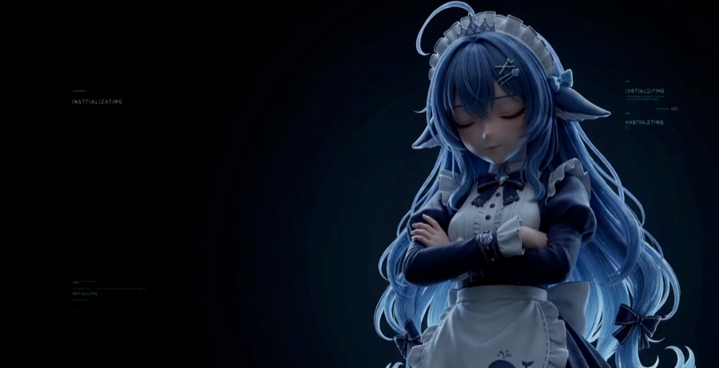
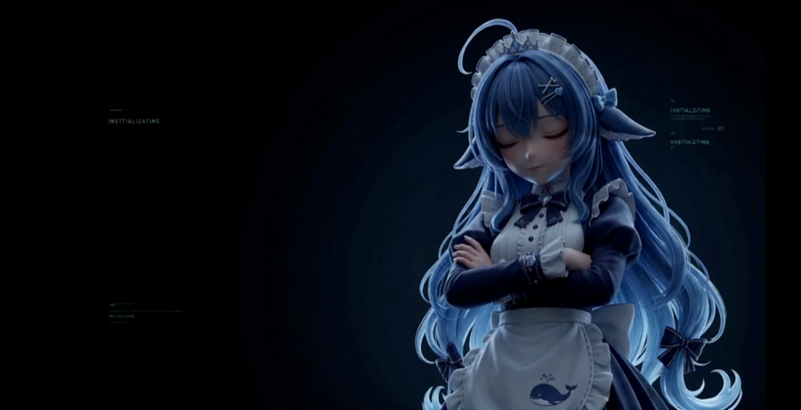

# dsh-boot-animation-pro

A **boot animation** for DSH: a video plays full-frame when you open DSH, start a
new conversation, or enter the conversation you pinned.

> An **enhanced fork** of
> [`NativeDog1/dsh-boot-animation`](https://github.com/NativeDog1/dsh-boot-animation),
> adding playback controls, trigger rules, library management, overlay effects,
> time-of-day clips and a bilingual UI. Provenance and licence: **[FORK.md](FORK.md)**.
> 中文: [README.md](README.md)

## What it looks like

| | |
|---|---|
|  |  |
| **Fill** (default): fills the window, crops the overflow, **no black bars** | **Whole frame**: everything visible, letterboxed when the ratios differ |

Both are **real browser measurements**, not mockups — Headless Chrome at a
2560×1313 viewport with a 1280×720 clip, read back by `scripts/verify-letterbox.mjs`:
fill mode leaves 0px of black, whole-frame mode leaves 113px on each side.

## Install

```sh
dsh plugin --profile web add github:Yiheng-guo/dsh-boot-animation-pro
```

> The built output (`lib/`) is committed and there is no `prepare` lifecycle
> script, so this installs **without compiling anything**.

Then **restart DSH** — bundle layers are assembled at boot.

### From a source checkout (development)

```sh
git clone https://github.com/Yiheng-guo/dsh-boot-animation-pro.git
cd dsh-boot-animation-pro
npm install && npm run build && npm run check

npm run dsh:link     # link this checkout into the profile (default: desktop)
npm run dsh:unlink   # undo it
```

`scripts/dsh-link.mjs` writes exactly what `dsh plugin add` writes — a symlink in
the profile's `node_modules`, one `dependencies` entry, one `dsh.profile.bundles`
entry — and is idempotent and reversible.

### Nothing happens after installing?

DSH serves client bundles with `cache-control: max-age=31536000, immutable`.
**Quit DSH completely and reopen it.** In a browser window, hard-reload
(**Ctrl+Shift+R**, **Cmd+Shift+R** on macOS).

> The desktop app does **not** bind `Cmd+Shift+R`. `Cmd+Q` and reopen is enough:
> the boot page is refetched, and `rev` is a **content hash**, so changed content
> means a changed URL and a cache miss.

## Usage

### When it plays

Click **🎛** in the sidebar footer → **Trigger** tab. Five modes:

| Mode | When |
|---|---|
| New conversation once + pinned every time | **Default** |
| Every new conversation once | Only a conversation with no turns yet |
| Every time a conversation opens | Most frequent — every switch plays |
| **Once per DSH start** | At most once per launch. **Pick this for "every time I open DSH"** |
| Never play automatically | Only the manual ▶ buttons play |

- **Cooldown** — do not auto-play until N minutes have passed (0 = no limit).
- **Session list** — no restriction / only in these sessions / never in these sessions.

Both are **vetoes** that apply to every mode, rather than two extra modes.

### Pin a conversation

Click **🎞** in the sidebar → green **🎬** means pinned, and the intro plays on
every entry from then on.

### Bring your own video

Drop an mp4 into `~/.dsh/boot-animation-pro/videos/`, then 🎛 → **Refresh** → **Use it**.

Every row has **▶ Preview** (play it now, change nothing), **Use it**, a
**☆ favourite**, **Rename** and **Delete** (with confirmation).

The previous version's `~/.dsh/boot-animation/` directory is scanned **read-only**,
so an existing library keeps working and is never deleted from here.

### Sound

The overlay always **starts muted**, because browsers refuse to autoplay with
sound. **Click the picture** to turn the sound on and go full screen. Turn off
"Start muted" to attempt sound immediately; if the browser refuses, the overlay
shows "Click to play" instead of going black.

### Everything else

- **Playback** — volume, start muted, 0.25×–2× speed, progress bar, auto-skip
  countdown, fade-out, fill/whole-frame, random playback.
- **Overlay** — title, subtitle, watermark, and four effects: scanlines,
  vignette, grain, glow.
- **Schedule** — swap intros by weekday and time of day. A window that crosses
  midnight (`22:00 → 02:00`) counts on the weekday it **starts**.
- **Interface** — follow the browser, 中文, or English.

## Troubleshooting

| Symptom | Cause / fix |
|---|---|
| Nothing at all | Check for the 🎞/🎛 buttons. Present → it is a trigger-rule question; absent → cache, `Cmd+Q` and reopen |
| Nothing on an existing conversation | **By design.** Pick "Once per DSH start" for "every time I open DSH" |
| No sound | It starts muted. **Click the picture** |
| Black overlay | The mp4's `moov` atom is probably at the end. The library badges those "⚠ not optimised"; fix with `ffmpeg -c copy -movflags +faststart` |
| Closes part-way | The 25-second watchdog — usually faststart or a slow decoder |
| Want to see what it is doing | Set `DEBUG = true` in `src/client/diagnostics.ts` and rebuild |

## Development

```sh
npm run check              # typecheck + 22 suites, ~570 assertions
npm run build              # rebuild lib/
npm run verify:letterbox   # measure black bars in a real browser (Chrome/Edge/Chromium)
```

Read the **invariant list** at the end of [ARCHITECTURE.md](ARCHITECTURE.md)
before changing anything. Three of them are hard constraints: breaking one either
takes the GUI down or loses user data.

## Security

The plugin's routes sit **outside** the web token DSH requires for the app shell.
Every mutating endpoint therefore runs the four gates in `src/host/route-guard.js`:
loopback `Host`, no `Sec-Fetch-Site: cross-site`, loopback `Origin`, and a required
`Content-Type: application/json`. `scripts/verify-route-guard.mjs` replays the
original attack and asserts **both** a 403 **and** that the file is still there.

## Licence

BSD-3-Clause, see [LICENSE](LICENSE) — carried over from upstream **byte-for-byte
unmodified**. This repository is a derivative of
[`NativeDog1/dsh-boot-animation`](https://github.com/NativeDog1/dsh-boot-animation);
original copyright remains with NativeDog1. See [FORK.md](FORK.md).
